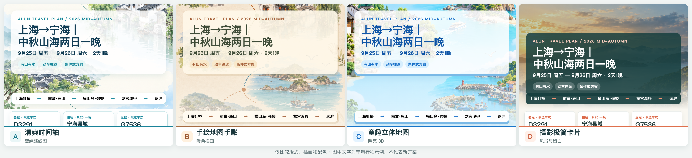
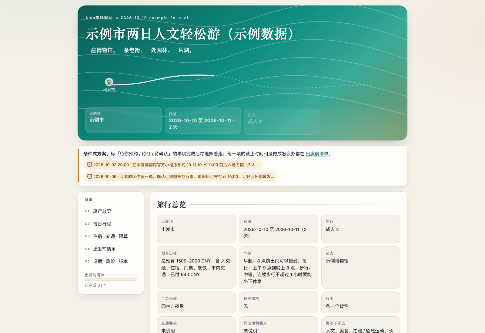
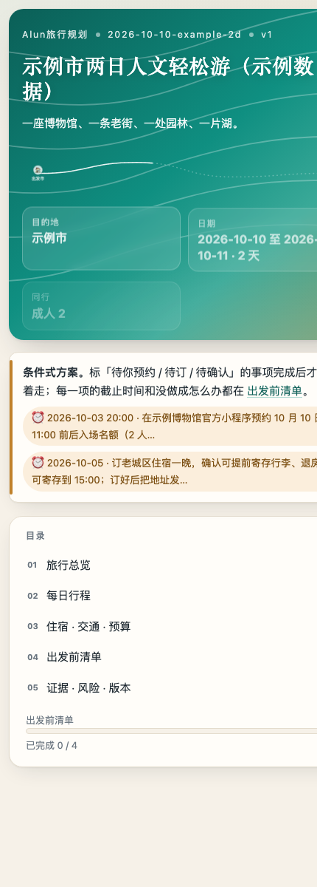

<h1 align="center">Alun旅行规划</h1>

<p align="center">
  <strong>从“想出去走走”，到一份真的能照着走的行程。</strong><br>
  选目的地 · 核查资料 · 安排每天 · 准备备选 · 生成 1:5 攻略长图
</p>

<p align="center">
  <a href="#一分钟了解">一分钟了解</a> ·
  <a href="#安装与开始">安装与开始</a> ·
  <a href="#先确认行程再选择风格">选风格</a> ·
  <a href="#交付内容">交付内容</a> ·
  <a href="#常见问题">常见问题</a>
</p>

---

Alun旅行规划是一个对话式旅行规划 Skill。你可以只给出“周末想找个有山有水的地方”，也可以交给它已订好的车票、酒店和一串想去的地点。它会把需求、资料来源、路线取舍、每日时段、费用、风险与出发前待办串成同一份计划。

它不是自动订票工具，也不会把查不到的票价、营业时间或船班写成确定事实。**方案先由你确认；长图风格再由你确认。** 最后才生成与文字攻略一致的精排长图。

> [!NOTE]
> 安装目录请命名为 `alun-travel-plan`，让支持自动发现 Skill 的助手正确识别它。

## 一分钟了解

| 你的情况 | 它会怎么帮你 |
| --- | --- |
| 还不知道去哪 | 比较几个有真实差异的目的地，说明往返时间、实际可玩时间、预算和主要缺点 |
| 地方定了，还没排行程 | 按区域、开放时段和交通衔接安排每天，留出吃饭、休息与机动时间 |
| 已订车票或酒店 | 先锁定已有安排，不悄悄更换，再围绕它们优化路线 |
| 天气、预约、船班有不确定性 | 把条件写在对应日程旁，并给出能衔接回主线的备选方案 |
| 想做一张好看的攻略图 | 先确认方案，再看一张 A–D 四列风格图；选好风格后生成 1:5 长图 |

核心流程只有两个需要你明确拍板的地方：

```text
说明需求 → 查证资料 → 排每日行程 → 核查可行性
                                ↓
                        ① 你确认行程方案
                                ↓
                       展示四列风格选择图
                                ↓
                        ② 你确认图片风格
                                ↓
             同版本 Markdown + 离线 HTML + 1:5 PNG
```

没有资料证明的内容会标为“待确认”或“估算”。用户确认喜欢这份方案，不等于车票、预约、天气和营业状态已经落实。

## 先确认行程，再选择风格

行程方案确认后，Skill 会发出下面这一张四列对比图，让你直接回复 **A / B / C / D**，也可以说“用 A 的时间轴、D 的摄影感”。图中的宁海行程文字只是视觉示例，**不会带进你的新行程**。



| 风格 | 视觉语言 | 更适合 |
| --- | --- | --- |
| **A 清爽时间轴** | 蓝绿配色、清晰的时间点和路线 | 行程密集，最在意阅读效率与交通顺序 |
| **B 手绘地图手账** | 暖纸色、手绘地标与虚线路线 | 想突出沿途风景和旅行感 |
| **C 童趣立体地图** | 明亮蓝色、立体场景与圆润卡片 | 轻松、亲子或活泼的主题 |
| **D 摄影极简卡片** | 大幅风景、留白和醒目的信息卡 | 希望兼顾照片氛围与实用信息 |

最终长图默认 **1500 × 7500 px（宽:高 = 1:5）**。它会从已经确认的行程数据中提取信息，覆盖总览、逐日时间线、交通住宿、费用、预约或风险、备用路线和出发前清单。长图是便于保存分享的精简阅读版；完整细节仍以同版本 Markdown 和 HTML 为准。

## 看看交付长什么样

下面的截图来自仓库内的**虚构演示行程**，只演示页面结构和阅读方式，不代表真实景点开放、票价或预约状态。

<p align="center">
  
</p>

离线 HTML 把日期导航、每日时间线、交通住宿、预算、出发前清单、证据和版本信息放在同一页；正文预先写入文件，断网或关闭 JavaScript 也能阅读。手机视图同样保留关键提醒：

<p align="center">
  
</p>

[打开 Markdown 示例](docs/examples/outputs/2026-10-10-example-2d_v1.md) · [打开离线 HTML 示例](docs/examples/outputs/2026-10-10-example-2d_v1.html) · [查看完整使用指南](docs/USAGE.md)

## 安装与开始

### 安装到 Codex

将这个仓库下载或克隆到 Codex 的 Skills 目录，并把本地文件夹命名为 `alun-travel-plan`：

```bash
git clone https://github.com/jiealun/alun-travel-plan.git "$HOME/.codex/skills/alun-travel-plan"
```

若该目录已经存在，请先在你自己的副本里检查本地修改，不要直接用克隆命令覆盖。安装后重新打开 Codex 任务或刷新 Skills 列表。其他支持 `SKILL.md` 的助手也可以把仓库放进各自的 Skill 目录；不支持自动发现时，直接让助手读取 `alun-travel-plan/SKILL.md`。

基本规划不要求地图、天气或酒店 API 账号。自动校验与 Markdown/HTML 渲染脚本使用 **Python 3.10+ 标准库**；图片输出依赖当前助手可用的生图或本地排版能力。

### 直接这样说

```text
周五到周六，从上海坐高铁去宁海玩两天一晚。想有山有水，节奏别太赶，
返程车次还没订。先查关键交通和景点条件，再给我一版能执行的方案。
```

或者从更模糊的想法开始：

```text
下个月有一个周末，从杭州出发，两个人，人均预算 1200 元。
喜欢古镇、徒步和当地小吃，不自驾。先比较三个方向，再帮我选。
```

已经有安排也没问题：

```text
高铁和酒店已经订好。我把时间、地址发给你；请保留这两项，
把第二天下午排得轻松些，并留一个下雨时能直接切换的备选。
```

信息给得越具体，方案越贴近你；信息不足时，Skill 会先问最影响路线的几件事，或清楚标明采用的假设，不会假装已经得到你的偏好。

## 交付内容

| 文件 | 作用 | 关键特性 |
| --- | --- | --- |
| `outputs/<trip_id>_v<N>.md` | 完整文字攻略 | 每日详细安排、规划依据、预算、风险、备选与来源 |
| `outputs/<trip_id>_v<N>.html` | 可分享的旅行手账 | 单文件、离线可读、适合手机查看与打印 |
| `outputs/<trip_id>_v<N>_1x5.png` | 方便保存的长图 | 只在方案和风格都确认后制作，比例精确为 1:5 |
| `trip.json` 与 `versions/` | 同一数据源和版本快照 | 修改行程时保留旧版，避免三种产物各说各话 |
| `audit.v<N>.json` 与 `manifest.v<N>.json` | 核查与产物记录 | 记录脚本检查结果、版本、指纹和文件状态 |

图片能否导出取决于宿主能力。如果当前环境无法可靠生成 PNG，会如实交付已完成的文字与 HTML，并说明长图未完成；不会把示例图冒充本次终稿。

## 这份攻略如何保持可靠

- **先核查，再写确定结论。** 开放时间、票价、预约、轮渡和列车等信息尽量对应到实际出行日期；常规营业规则不等于节假日已经核实。
- **保留来源与状态。** 区分已核实、经验信息、估算、未知和冲突；搜索摘要不自动等于已验证事实。
- **把路上的时间算进去。** 不只列景点，还考虑前后转场、排队、吃饭、休息、行李和返程安检缓冲。
- **重要变化先请你决定。** 增加费用、取消必去项目、改动已订安排或明显提高体力强度，不会悄悄替你拍板。
- **备用路线要能落地。** 写明触发条件、替换哪段、从哪里接回主线，以及时间和费用变化。
- **出发前仍需复核。** 方案状态反映的是核查当时的信息；天气、余票、班次和临时公告可能变化。

### 资料、隐私与费用边界

旅行资料可来自宿主已有工具与公开网页。小红书资料（TikHub）是可选增强，只有在你同意、具备凭据并确认调用预算后才使用；不用它也能完成基本规划。生成本地攻略不等于同意上传私人行程、保存长期偏好或对外发布。

这个 Skill **不会替你订票、支付、预约、取消或改签**。令牌不能写进 `trip.json`、Markdown、HTML 或长图。更详细的运行与降级规则见 [SKILL.md](SKILL.md) 和 [使用指南](docs/USAGE.md)。

## 项目结构

```text
alun-travel-plan/
├── SKILL.md                         对话入口、阶段关口与底线
├── references/                      需求、调研、规划、核查、交付和长图细则
├── assets/
│   ├── style-references/
│   │   └── style-choice-1x4.png     A–D 四列风格选择图
│   ├── schemas/                      行程、核查与产物数据契约
│   └── templates/                    离线 HTML 模板与署名配置
├── scripts/                          校验、渲染、版本管理和长图登记
├── docs/                             使用指南、截图与虚构示例
├── README.md
└── LICENSE
```

想了解如何手动运行脚本，可从 [docs/USAGE.md](docs/USAGE.md) 开始；数据字段的准确定义在 [assets/schemas/README.md](assets/schemas/README.md)。

## 常见问题

<details>
<summary>为什么要确认两次？</summary>

第一次确认的是路线、时间、预算和风险；第二次只确认长图的视觉风格。选中了漂亮的版式，不代表行程中的预约已经完成，也不应该偷偷改变已确认的安排。
</details>

<details>
<summary>四列风格图里写着宁海，新的旅行也会出现宁海吗？</summary>

不会。它是固定的视觉参考图，只用于比较配色、插画和排版。终稿文字从本次确认的行程数据提取，并逐项核对日期、地点、金额和重要提醒。
</details>

<details>
<summary>没有地图、天气或生图工具还能用吗？</summary>

可以继续做基础规划，但缺失信息会标为估算或待确认；无法导出长图时会明确说明，不会伪称已生成。目的地、交通或开放信息若缺少足够证据，也不会被写成“截至核查时可执行”。
</details>

<details>
<summary>改了第二天，还能保留第一天吗？</summary>

可以。Skill 会保留未改动的已订事项和原有版本，只重新核查受影响的路段、费用、清单与事实；旧长图标记过期，新方案再走确认流程。
</details>

## 参与和许可

欢迎通过 [Issues](https://github.com/jiealun/alun-travel-plan/issues) 反馈真实使用中的问题，或阅读 [CONTRIBUTING.md](CONTRIBUTING.md) 参与改进。

本项目采用 [MIT License](LICENSE)。Alun 修改版的署名为「由 Alun旅行规划生成」；原项目版权声明按许可证要求保留在 `LICENSE` 中。
